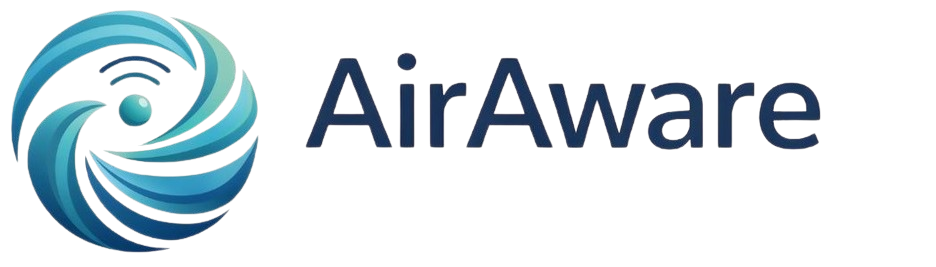

<!-- ====================== HEADER: NAME ANIM ====================== -->

  

  <b>DevOps Engineer</b> &nbsp;·&nbsp; <b>Data Analyst</b>

  <code>&gt; whoami</code> 
  CS student building infrastructure, automation, and data systems.

<!-- ====================== EXPERIENCE ====================== -->
## Experience

<table>
  <tr>
    <td width="160" valign="middle" align="center">
      
    </td>
    <td valign="middle">
      <b>System &amp; AI Architecture Director</b> 
      <a href="https://airaware.network/">AirAware Network</a> 
      Leading the end-to-end system and AI architecture for environmental air-quality monitoring.
    </td>
  </tr>
</table>

<!-- ====================== TECH STACK ====================== -->
## Tech Stack

**Languages**

**Frameworks & Server-Side**

**Cloud — Instances, Servers & Managed Services**

**Databases**

<!-- ====================== PROJECTS ====================== -->
## Projects

- **Scanny** — A smart vending machine system.
- **Miniature DBMS** — A lightweight database management system built from scratch.

<!-- ====================== CONTACT ====================== -->
## Contact

